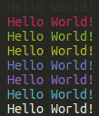

{backmatter}

# Solutions {#solutions}

## Argument Parsing {#argument_parsing}

Contents of `greet.sh`:

<<[Argument Parsing](code/greet.sh)

## Nested Directories {#nested_directories}

Contents of `nested-directories.sh`:

<<[Nested Directories](code/nested-directories.sh)

## Colorful Text {#colorful_text}

Contents of `colorful-text.sh`:

<<[Nested Directories](code/colorful-text.sh)

Output:

## Factorial {#factorial}

Contents of `factorial.sh`:

<<[Factorial](code/factorial.sh)