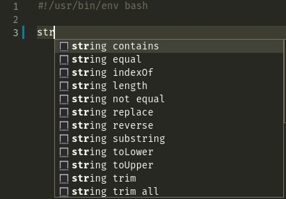

# Shellman Structure {#structure}

*Shellman* divides its content into semantical categories named **namespace**. The concept is already familiar to programmers, but in simple words it means *keeping related materials together under a generic name*. So if you need to do something with `String` like changing it to `upper case` then it makes sense to look at `String` namespace.

*Shellman* is structured into [namespaces](#namespaces), so it is useful to know supported namespaces and their members. There is no order in learning [namespaces](#namespaces) and you can learn them on need, but before that, you need to know a few things about *shell scripting*. I will try my best to keep [Basics](#basics) section short and simple so you can move fast to desired [namespaces](#namespaces).
